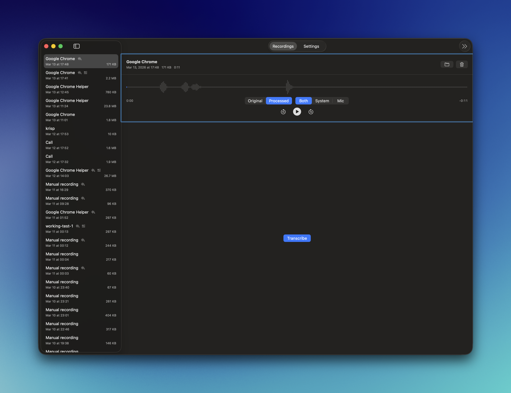

<p align="center">
  
</p>

<h1 align="center">Blackbox</h1>

<p align="center">macOS menu bar app that automatically records audio from your calls.</p>

Detects when your microphone becomes active (e.g. during calls) and records system audio automatically. Works with any app - Zoom, Meet, Teams, Discord, FaceTime, Telegram, and more. Saves M4A files locally.

<p align="center">
  
</p>

## Install

Via [Homebrew](https://brew.sh):

```bash
brew install --cask tenequm/tap/blackbox
```

Or download the latest `.dmg` from [Releases](https://github.com/tenequm/blackbox/releases), open it, and drag Blackbox to Applications.

Requires macOS 26.1 or later. On first launch, grant Screen Recording and Microphone permissions when prompted.

## Features

- Auto-records when your microphone becomes active (any calling app)
- Manual record/stop for on-demand system audio capture
- Dual-track M4A (system audio + microphone in manual recordings)
- Notification when recording is saved (click to reveal in Finder)
- Configurable grace period, save location, and notification preferences
- Auto-updates

## Build from source

```bash
git clone https://github.com/tenequm/blackbox.git
cd blackbox
make install
open /Applications/Blackbox.app
```

Requires macOS 26.1+ and Swift 6.2+ (Xcode 26+).

## Acknowledgments

Blackbox's ScreenCaptureKit audio capture architecture was informed by studying [Azayaka](https://github.com/Mnpn/Azayaka) by Martin Persson - a clean, well-built macOS screen and audio recorder. Azayaka's approach to dual-track recording and its PCM buffer conversion patterns (based on [Apple's ScreenCaptureKit documentation](https://developer.apple.com/documentation/screencapturekit/capturing_screen_content_in_macos) and [this gist by aibo-cora](https://gist.github.com/aibo-cora/c57d1a4125e145e586ecb61ebecff47c)) were valuable references during development.

## License

GPL v3 - see [LICENSE](LICENSE)
